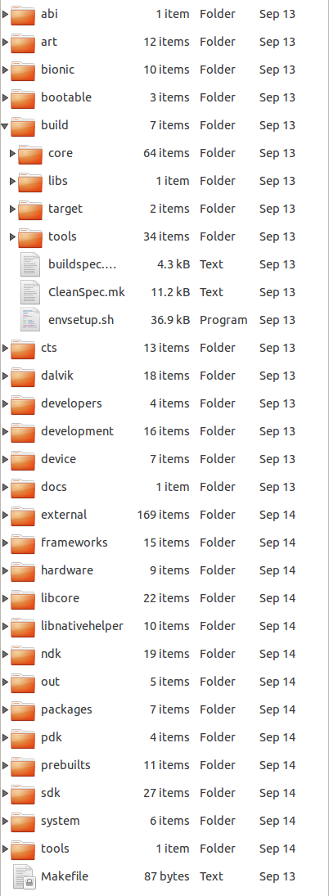
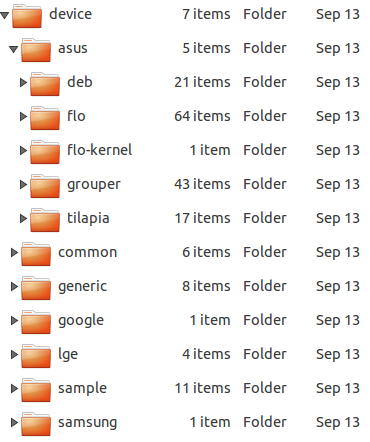
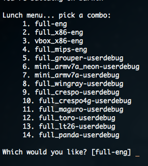

#Understand Android Build System

***

##repo介绍   
**repo**是google用python写的一个调用git的一个脚本，由于Android项目非常巨大，采用一个git repo显然已经不能
满足Android源码管理的需要，这样Android就被划分成了几百个git repo，但是这样以来，管理各个git repo的工
作就变得非常困难（同步、分支的操作等等），所以google就在git之上构建了主要用于管理Android源码的repo。
repo实现管理多个git repo，一般是多个项目公用一个主分支，而针对项目公用分支的代码都可以在overlay目录里
进行开发。   
具体资料请参考:[Google Repo Introduce](https://source.android.com/source/developing.html)
   
***

##理解 Android Build 系统

###前言
Andoid Build系统主要用来编译Android系统，Android SDK以及相关文档，该系统主要由Make文件、Shell脚本以及Python
脚本组成，其中MakeFile最重要。大家都知道，Android是一个开源的操作系统，其中其源码包含了大量的开源项目以及很多模块，
不同厂商的不同设备对于Android系统的定制也是不一样的，如何将这些项目和模块的编译统一管理起来，如何能够在不同的操作系
统上进行编译，如何在编译时能够支持面向不同的硬件设备，不同的编译类型，且还要提供面向各个厂商商的定制扩展，是非常有难度的。   

Build 系统中最主要的处理逻辑都在 Make 文件中，而其他的脚本文件只是起到一些辅助作用，整个 Build 系统中的 Make 文件可以
分为三类：   
第一类是 Build 系统核心文件，此类文件定义了整个 Build 系统的框架，而其他所有 Make 文件都是在这个框架的基础上
编写出来的。Build 系统核心文件全部位于 /build/core目录下。   
   

第二类是针对某个产品（一个产品可能是某个型号的手机或者平板电脑）的 Make 文件，这些文件通常位于 device 目录下，
该目录下又以公司名以及产品名分为两级目录，对于一个产品的定义通常需要一组文件，这些文件共同构成了对于这个产品的定义。   
 
   

第三类针对某个模块的 Make 文件。整个系统中，包含了大量的模块，每个模块都有一个专门的 Make 文件，这类文件的名称统一
为“Android.mk”，该文件中定义了如何编译当前模块。Build 系统会在整个源码树中扫描名称为“Android.mk”的文件并根据其中
的内容执行模块的编译。
###编译 Android 系统
前文：[编译Android源码](https://github.com/firegnu/Blog/blob/master/Compile%20Android%20SourceCode%20with%20Ubuntu14.04.md)
已经讲述了如何在Ubuntu14.04上编译Android源码，此处不再赘述，其中值得关注的是最终实现编译的三条命令：   
       ```
       $ source build/envsetup.sh
       ```     
       ```
       $ lunch full-eng
       ```   
       ```
       $ make -j8
       ```     
其中第一行命令“source build/envsetup.sh”引入了 build/envsetup.sh脚本。该脚本的作用是初始化编译环境，并引入一
些辅助的 Shell 函数，这其中就包括第二步使用 lunch 函数。除此之外，该文件中还定义了其他一些常用的函数，其中一些命令
会在此后的改动源码的过程中使用到:     
       ```
       croot: 切换到源码树的根目录
       ```     
       ```
       m: 在源码树的根目录执行 make
       ```   
       ```
       mm: Build 当前目录下的模块
       ```   
       ```
       mmm: Build 指定目录下的模块
       ```     
       ```
       cgrep: 在所有 C/C++ 文件上执行 grep
       ```   
       ```
       jgrep: 在所有 Java 文件上执行 grep
       ```   
       ```
       resgrep: 在所有 res/*.xml 文件上执行 grep
       ```     
       ```
       godir: 转到包含某个文件的目录路径
       ```   
       ```
       printconfig: 显示当前 Build 的配置信息
       ```  
       ```
       add_lunch_combo: 在 lunch 函数的菜单中添加一个条目
       ```    
第二行命令“lunch full-eng”是调用 lunch 函数，并指定参数为“full-eng”。lunch 函数的参数用来指定此次编译的目标设备以
及编译类型。在这里，这两个值分别是“full”和“eng”。“full”是 Android 源码中已经定义好的一种产品，是为模拟器而设置的。而
编译类型会影响最终系统中包含的模块，关于编译类型会在下面详细讲解。如果调用 lunch 函数的时候没有指定参数，那么该函数将
输出列表以供选择，此时可以通过输入编号或者名称进行选择。如图所示   
   
第三行命令“make -j8”才真正开始执行编译。
###Build 结果的目录结构
Build 的产物中最重要的是三个镜像文件，它们都位于 /out/target/product/<product_name>/ 目录下。这三个文件是：   
1. system.img：包含了 Android OS 的系统文件，库，可执行文件以及预置的应用程序，将被挂载为根分区。   
2. ramdisk.img：在启动时将被 Linux 内核挂载为只读分区，它包含了 /init 文件和一些配置文件。它用来挂载其他系统镜像并启动 init 进程。   
3. userdata.img：将被挂载为 /data，包含了应用程序相关的数据以及和用户相关的数据。   
###Make 文件说明
整个 Build 系统的入口文件是源码树根目录下名称为“Makefile”的文件，当在源代码根目录上调用 make 命令时，make 命令首先将读取该文件。
Makefile 文件的内容只有一行：“include build/core/main.mk”。该行代码的作用很明显：包含 build/core/main.mk 文件。在 main.mk 
文件中又会包含其他的文件，其他文件中又会包含更多的文件，这样就引入了整个 Build 系统。这些 Make 文件间的包含关系是相当复杂的。它们都
位于 build/core/ 目录下。基本关系如下:   
   

以下为上图提到的这些文件的作用:   
1.main.mk:  最主要的Make文件，该文件主要首先对编译环境进行检查，同时引入其他Make文件，另外，该文件中还定义了几个主要的
Make目标，例如sdk等等。   
2.help.mk:  包含了名称为help的Make目标的定义，该目标将列出主要的Make目标及其说明。   
3.pathmap.mk:  将许多头文件的路径通过名值对应的方式定义为映射表，并提供include-path-for函数来获取。   
4.envsetup.mk:  配置Build系统所需要的环境变量，例如：TARGET_PRODUCT，TARGET_BUILD_VARIANT，HOST_OS，HOST_ARCH 等。
当前编译的主机平台信息（例如操作系统，CPU 类型等信息）就是在这个文件中确定的。另外，该文件中还指定了各种编译结果的输出路径。   
5.combo/select.mk:  根据当前编译器的平台选择平台相关的 Make 文件。   
6.dumpvar.mk:  在 Build 开始之前，显示此次 Build 的配置信息。   
7.config.mk:  整个 Build 系统的配置文件，最重要的 Make 文件之一。主要作用为:   
           ```
           定义了许多的常量来负责不同类型模块的编译。(BUILD_HOST_STATIC_LIBRARY,BUILD_HOST_SHARED_LIBRARY等等)
           ```     
           ```
           定义编译器参数以及常见文件后缀，例如 .zip,.jar.apk。
           ```   
           ```
           根据 BoardConfig.mk 文件，配置产品相关的参数。
           ```   
           ```
           设置一些常用工具的路径，例如 flex，e2fsck，dx。
           ```   
8.definitions.mk:  最重要的 Make 文件之一，在其中定义了大量的函数。这些函数都是 Build 系统的其他文件将用到的。
如：my-dir，all-subdir-makefiles，find-subdir-files，sign-package 等。   
9.distdir.mk:  针对 dist 目标的定义。dist 目标用来拷贝文件到指定路径。   
10.dex_preopt.mk:  针对启动 jar 包的预先优化。   
11.pdk_config.mk:  针对 pdk（Platform Developement Kit）的配置文件。   
12.${ONE_SHOT_MAKEFILE}:  ONE_SHOT_MAKEFILE 是一个变量，当使用“mm”编译某个目录下的模块时，此变量的值即为当前指定路
径下的 Make 文件的路径。   
13.${subdir_makefiles}:  各个模块的 Android.mk 文件的集合，这个集合是通过 Python 脚本扫描得到的。
14.post_clean.mk:  在前一次 Build 的基础上检查当前 Build 的配置，并执行必要清理工作。   
15.legacy_prebuilts.mk:  该文件中只定义了 GRANDFATHERED_ALL_PREBUILT 变量。   
16.Makefile:  被 main.mk 包含，该文件中的内容是辅助 main.mk 的一些额外内容。   
Android 源码中包含了许多的模块，模块的类型有很多种，例如：Java 库，C/C++ 库，APK 应用，以及可执行文件等 。


###Make 目标说明
如果在源码树的根目录直接调用“make”命令而不指定任何目标，则会选择默认目标：“droid”（在 main.mk 中定义）。因此，这和执行“make droid”效果是一样的。   
droid 目标将编译出整个系统的镜像。从源代码到编译出系统镜像，整个编译过程非常复杂。这个过程并不是在 droid 一个目标中定义的，而是droid 目标会依赖许多
其他的目标，这些目标的互相配合导致了整个系统的编译。   
Build 系统中包含的其他一些 Make 目标说明如下:   
make clean:  执行清理，等同于：rm -rf out/。   
make sdk:  编译出 Android 的 SDK。   
make clean-sdk:  清理 SDK 的编译产物。   
make update-api:  更新 API。在 framework API 改动之后，需要首先执行该命令来更新 API，公开的 API 记录在frameworks/base/api 目录下。   
make dist:  执行 Build，并将 MAKECMDGOALS 变量定义的输出文件拷贝到 /out/dist 目录。   
make all:  编译所有内容，不管当前产品的定义中是否会包含。   
make help:  帮助信息，显示主要的 make 目标。   
make snod:  从已经编译出的包快速重建系统镜像。   
make libandroid_runtime:  编译所有 JNI framework 内容。   
makeframework:  编译所有 Java framework 内容。   
makeservices:  编译系统服务和相关内容。   
make <local_target>:  编译一个指定的模块，local_target 为模块的名称。   
make clean-<local_target>:  清理一个指定模块的编译结果。   
makedump-products:  显示所有产品的编译配置信息，例如：产品名，产品支持的地区语言，产品中会包含的模块等信息。   
makePRODUCT-xxx-yyy:  编译某个指定的产品。   
makebootimage:  生成 boot.img。   
makerecoveryimage:  生成 recovery.img。   
makeuserdataimage:  生成 userdata.img。   
makecacheimage:  生成 cache.img。


###在 Build 系统中添加新的内容
####添加新的产品
当我们要开发一款新的 Android 产品的时候，我们首先就需要在 Build 系统中添加对于该产品的定义。在 Android Build 系统中对产品定义的文件通常位于 device 目录下
。device 目录下根据公司名以及产品名分为二级目录，这一点我们在前面已经提到过。   
通常，对于一个产品的定义通常至少会包括四个文件：AndroidProducts.mk，产品版本定义文件，BoardConfig.mk 以及 verndorsetup.sh。下面详细说明这几个文件。   
    AndroidProducts.mk：该文文件中的内容很简单，其中只需要定义一个变量，名称为“PRODUCT_MAKEFILES”，该变量的值为产品版本定义文件名的列表，例如：   
    ```
    PRODUCT_MAKEFILES := \
    ```   
    ```
    $(LOCAL_DIR)/aosp_flo.mk \
    ```   
    ```
    $(LOCAL_DIR)/full_flo.mk
    ```   
    产品版本定义文件：该文件中包含了对于特定产品版本的定义。该文件可能不只一个，因为同一个产品可能会有多种版本（例如，面向中国地区一个版本，面向北美地区一个版本）。
    该文件中可以定义的变量以及含义说明如下:   
    PRODUCT_NAME:  最终用户将看到的完整产品名，会出现在“关于手机”信息中。   
    PRODUCT_MODEL:  产品的型号，这也是最终用户将看到的。   
    PRODUCT_LOCALES:  该产品支持的地区，以空格分格，例如：en_GB de_DE es_ES fr_CA。   
    PRODUCT_PACKAGES: 该产品版本中包含的 APK 应用程序，以空格分格，例如：Calendar Contacts。   
    PRODUCT_DEVICE:  该产品的工业设计的名称。   
    PRODUCT_MANUFACTURER:  制造商的名称。   
    PRODUCT_BRAND:  该产品专门定义的商标（如果有的话）。   
    PRODUCT_PROPERTY_OVERRIDES: 对于商品属性的定义。   
    PRODUCT_COPY_FILES:  编译该产品时需要拷贝的文件，以“源路径 : 目标路径”的形式。   
    PRODUCT_OTA_PUBLIC_KEYS:  对于该产品的 OTA 公开 key 的列表。   
    PRODUCT_POLICY:  产品使用的策略。   
    PRODUCT_PACKAGE_OVERLAYS:  指出是否要使用默认的资源或添加产品特定定义来覆盖。   
    PRODUCT_CONTRIBUTORS_FILE:  HTML 文件，其中包含项目的贡献者。   
    PRODUCT_TAGS: 该产品的标签，以空格分格。   
通常情况下，我们并不需要定义所有这些变量。Build 系统的已经预先定义好了一些组合，它们都位于 /build/target/product 下，每个文件定义了一个组合，我们只要继承这些预置
的定义，然后再覆盖自己想要的变量定义即可。   
   
BoardConfig.mk：该文件用来配置硬件主板，它其中定义的都是设备底层的硬件特性。例如：该设备的主板相关信息，Wifi 相关信息，还有 bootloader，内核，radioimage 等信息。   
   
   
vendorsetup.sh：该文件中作用是通过 add_lunch_combo 函数在 lunch 函数中添加一个菜单选项。该函数的参数是产品名称加上编译类型，中间以“-”连接，
例如：add_lunch_combo full_firegnu-userdebug。/build/envsetup.sh 会扫描所有 device 和 vender二级目录下的名称为"vendorsetup.sh"文件，并根据其中的内容来确定 lunch 函数的 菜单选项。   
在配置了以上的文件之后，便可以编译出我们新添加的设备的系统镜像了。首先，调用“source build/envsetup.sh”该命令的输出中会看到 Build 系统已经引入了刚刚添加的 vendorsetup.sh 文件。
然后再调用“lunch”函数，该函数输出的列表中将包含新添加的 vendorsetup.sh 中添加的条目。然后通过编号或名称选择即可。最后，调用“make -j*”来执行编译即可。   
####向Build系统中添加新的模块
在源码树中，一个模块的所有文件通常都位于同一个文件夹中。为了将当前模块添加到整个 Build 系统中，每个模块都需要一个专门的 Make 文件，该文件的名称为“Android.mk”。Build 系统会扫描名称为“Android.mk”的文件，
并根据该文件中内容编译出相应的产物。需要注意的是：在 Android Build 系统中，编译是以模块（而不是文件）作为单位的，每个模块都有一个唯一的名称，一个模块的依赖对象只能是另外一个模块，而不能是其他类型的对象。
对于已经编译好的二进制库，如果要用来被当作是依赖对象，那么应当将这些已经编译好的库作为单独的模块。   
//ToDo


***


##sample:模块化编译&增量编译
###模块化编译
前面已经提到过Android Build模块化的概念，以及一些相对应的命令，这些命令都定义在前面所说的envsetup.sh文件中其中对模块编译有帮助的是m、mm、mmm这几个命令。   
其中'mmm'命令后面要跟模块的根目录，不是所有的目录下都有子目录，那些含有Android.mk文件的目录才是模块的根目录，模块名称可以从Android.mk文件中的LOCAL_MODULE
或者LOCAL_PACKAGE_NAME变量中得到。   
单独编译某模块，需要在mmm后面指定模块路径，例如编译application中的Launcher2：   
```
mmm packages/apps/Launcher2/
```   
或者直接执行   
```
make module-name
```   
另外'm'和'mm'命令也基本和'mmm'命令类似。在此不赘述。
###增量编译
假如我们修改了某个模块下的代码，南无我们只需要重新编译这个模块就可以了，而不需要整个Android工程的再编译。步骤如下:   
1.  编译所修改的代码所在模块，例如:   
```
mmm packages/apps/Launcher2
```   
2.  重新生成新的镜像即可完成增量编译，将新的镜像重新加载就可看到修改后的代码      
```
make snod
``` 

***


##参考资料
[Android Open Source Project](http://source.android.com/)     Android Source 官方网站   
[Android Build System](http://people.linaro.org/~asac/build-system.html)     Build 系统中包含的说明文档   
[GNU `make'](http://www.gnu.org/software/make/manual/html_node/index.html)     GNU make 官方手册   
[Android Device](http://elinux.org/Android_Device)     大致介绍了 Build 系统中的一些文件   
[Build System](https://sites.google.com/a/itspaclub.com/www/android/android-build-system-anatomy)     另一个关于 Build 系统的说明资料   
[Add new target](http://www.android-x86.org/documents/how-to-add-new-x86-platforms)     该文档描述了如何添加一个新的产品目标   
[XDA Developer Resources](http://xda-university.com/as-a-developer)     XDA社区的相关开发资源   
    

