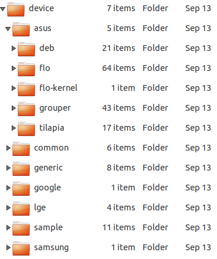

#Understand Android Build System

***

##repo介绍   
**repo**是google用python写的一个调用git的一个脚本，由于Android项目非常巨大，采用一个git repo显然已经不能
满足Android源码管理的需要，这样Android就被划分成了几百个git repo，但是这样以来，管理各个git repo的工
作就变得非常困难（同步、分支的操作等等），所以google就在git之上构建了主要用于管理Android源码的repo。
repo实现管理多个git repo，一般是多个项目公用一个主分支，而针对项目公用分支的代码都可以在overlay目录里
进行开发。   
具体资料请参考:[Google Repo Introduce](https://source.android.com/source/developing.html)
   
***

##理解 Android Build 系统

###前言
Andoid Build系统主要用来编译Android系统，Android SDK以及相关文档，该系统主要由Make文件、Shell脚本以及Python
脚本组成，其中MakeFile最重要。大家都知道，Android是一个开源的操作系统，其中其源码包含了大量的开源项目以及很多模块，
不同厂商的不同设备对于Android系统的定制也是不一样的，如何将这些项目和模块的编译统一管理起来，如何能够在不同的操作系
统上进行编译，如何在编译时能够支持面向不同的硬件设备，不同的编译类型，且还要提供面向各个厂商商的定制扩展，是非常有难度的。   

Build 系统中最主要的处理逻辑都在 Make 文件中，而其他的脚本文件只是起到一些辅助作用，整个 Build 系统中的 Make 文件可以
分为三类：   
第一类是 Build 系统核心文件，此类文件定义了整个 Build 系统的框架，而其他所有 Make 文件都是在这个框架的基础上
编写出来的。Build 系统核心文件全部位于 /build/core目录下。   
   

第二类是针对某个产品（一个产品可能是某个型号的手机或者平板电脑）的 Make 文件，这些文件通常位于 device 目录下，
该目录下又以公司名以及产品名分为两级目录，对于一个产品的定义通常需要一组文件，这些文件共同构成了对于这个产品的定义。   
 
   

第三类针对某个模块的 Make 文件。整个系统中，包含了大量的模块，每个模块都有一个专门的 Make 文件，这类文件的名称统一
为“Android.mk”，该文件中定义了如何编译当前模块。Build 系统会在整个源码树中扫描名称为“Android.mk”的文件并根据其中
的内容执行模块的编译。
###编译 Android 系统
前文：[编译Android源码](https://github.com/firegnu/Blog/blob/master/Compile%20Android%20SourceCode%20with%20Ubuntu14.04.md)
已经讲述了如何在Ubuntu14.04上编译Android源码，此处不再赘述，其中值得关注的是最终实现编译的三条命令：   
       ```
       $ source build/envsetup.sh
       ```     
       ```
       $ lunch full-eng
       ```   
       ```
       $ make -j8
       ```     
其中第一行命令“source build/envsetup.sh”引入了 build/envsetup.sh脚本。该脚本的作用是初始化编译环境，并引入一
些辅助的 Shell 函数，这其中就包括第二步使用 lunch 函数。除此之外，该文件中还定义了其他一些常用的函数，其中一些命令
会在此后的改动源码的过程中使用到:     
       ```
       croot: 切换到源码树的根目录
       ```     
       ```
       m: 在源码树的根目录执行 make
       ```   
       ```
       mm: Build 当前目录下的模块
       ```   
       ```
       mmm: Build 指定目录下的模块
       ```     
       ```
       cgrep: 在所有 C/C++ 文件上执行 grep
       ```   
       ```
       jgrep: 在所有 Java 文件上执行 grep
       ```   
       ```
       resgrep: 在所有 res/*.xml 文件上执行 grep
       ```     
       ```
       godir: 转到包含某个文件的目录路径
       ```   
       ```
       printconfig: 显示当前 Build 的配置信息
       ```  
       ```
       add_lunch_combo: 在 lunch 函数的菜单中添加一个条目
       ```    
第二行命令“lunch full-eng”是调用 lunch 函数，并指定参数为“full-eng”。lunch 函数的参数用来指定此次编译的目标设备以
及编译类型。在这里，这两个值分别是“full”和“eng”。“full”是 Android 源码中已经定义好的一种产品，是为模拟器而设置的。而
编译类型会影响最终系统中包含的模块，关于编译类型会在下面详细讲解。如果调用 lunch 函数的时候没有指定参数，那么该函数将
输出列表以供选择，此时可以通过输入编号或者名称进行选择。如图所示   
   
第三行命令“make -j8”才真正开始执行编译。
###Build 结果的目录结构
Build 的产物中最重要的是三个镜像文件，它们都位于 /out/target/product/<product_name>/ 目录下。这三个文件是：   
1. system.img：包含了 Android OS 的系统文件，库，可执行文件以及预置的应用程序，将被挂载为根分区。   
2. ramdisk.img：在启动时将被 Linux 内核挂载为只读分区，它包含了 /init 文件和一些配置文件。它用来挂载其他系统镜像并启动 init 进程。   
3. userdata.img：将被挂载为 /data，包含了应用程序相关的数据以及和用户相关的数据。   
###Make 文件说明
整个 Build 系统的入口文件是源码树根目录下名称为“Makefile”的文件，当在源代码根目录上调用 make 命令时，make 命令首先将读取该文件。
Makefile 文件的内容只有一行：“include build/core/main.mk”。该行代码的作用很明显：包含 build/core/main.mk 文件。在 main.mk 
文件中又会包含其他的文件，其他文件中又会包含更多的文件，这样就引入了整个 Build 系统。这些 Make 文件间的包含关系是相当复杂的。它们都
位于 build/core/ 目录下。基本关系如下:   
   

###Make 目标说明


